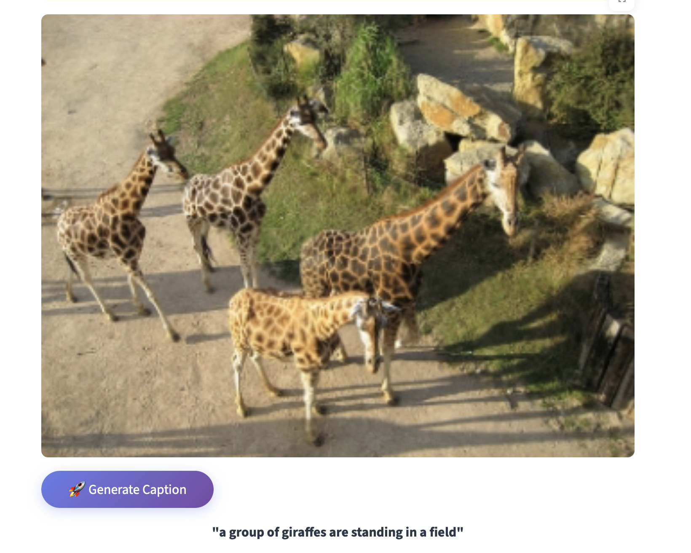
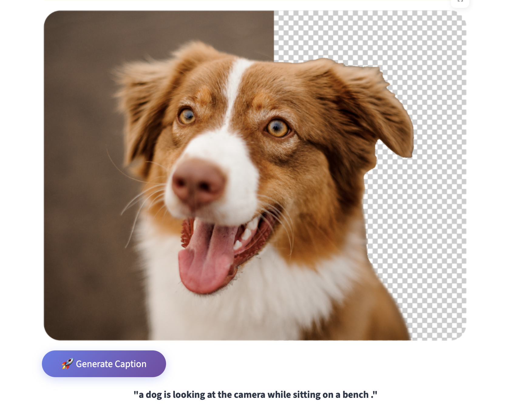

# ViTex: Vision-to-Text Image Captioning

ViTex generates captions for images using a **ResNet + LSTM** architecture.  
The model was trained on the [COCO Image Caption dataset](https://www.kaggle.com/datasets/nikhil7280/coco-image-caption) using a **Tesla P100 GPU on Kaggle Notebooks**.  
This repository provides both the **training notebook** and an **interactive Streamlit interface** for generating captions.

---

## 🚀 Features
- 📷 **Automatic Image Captioning** powered by ResNet encoder + LSTM decoder
- 🧠 **Pretrained model** trained on the COCO dataset
- 💻 **Streamlit interface** for uploading images and generating captions
- 🛠️ Clear preprocessing scripts for reproducibility (`resize.py`, `build_vocab.py`)

---

## 📸 Screenshots

Here are a few previews of **ViTex** in action:

| | |
|--------------|-------------------|
|  |  |

---

## 🗄️ Dataset
We used the **COCO Image Caption dataset** from Kaggle:  
👉 [COCO Image Caption Dataset](https://www.kaggle.com/datasets/nikhil7280/coco-image-caption)  

Each image in the dataset is paired with multiple human-written captions, making it ideal for supervised caption generation.

---

## 🏗️ Model Architecture
- **Encoder**: Pretrained **ResNet** extracts visual features from the image  
- **Decoder**: An **LSTM network** generates word sequences (captions) from these features  
- **Loss Function**: Cross-Entropy Loss with teacher forcing  
- **Optimizer**: Adam with learning rate scheduling  

---

## ⚙️ Setup
Clone the repo and install dependencies:
```bash
git clone https://github.com/yashparalkar/ViTex.git
cd ViTex
pip install -r requirements.txt
```

---

✅ Now the **Usage** section has the full command sequence in the right order:
1. Clone + install requirements  
2. Run `resize.py`  
3. Run `build_vocab.py`  
4. Run `streamlit run app.py`  

## 📥 Pretrained Weights
The trained model weights (~300MB) are stored externally on Dropbox.

👉 [Download Encoder Weights](https://www.dropbox.com/scl/fi/gxlgj80g0hikzs94iyher/encoder-5-3000.ckpt?rlkey=77ivwwqooo4wg3zbyjwcl7qsd&st=x9gk9xwm&dl=0)  
👉 [Download Decoder Weights](https://www.dropbox.com/scl/fi/h7iqb4tj6iszpil2rmrdz/decoder-5-3000.ckpt?rlkey=j37nl362evzgtn5n6k71hn2ht&st=di71xe4y&dl=0)  

After downloading, place both files into the `models/` directory:

